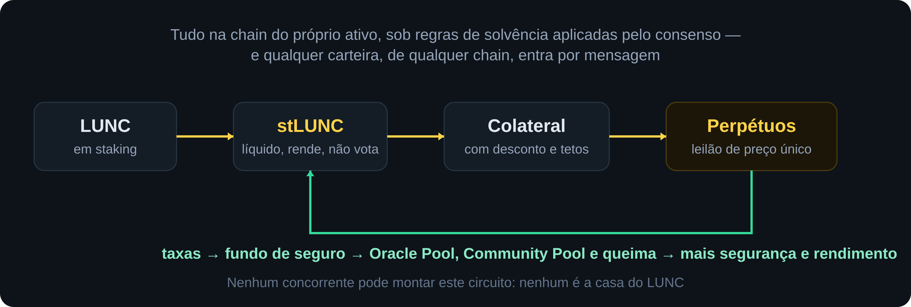
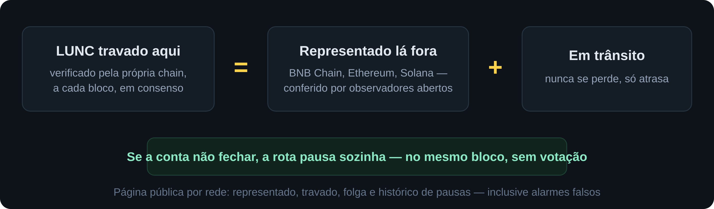
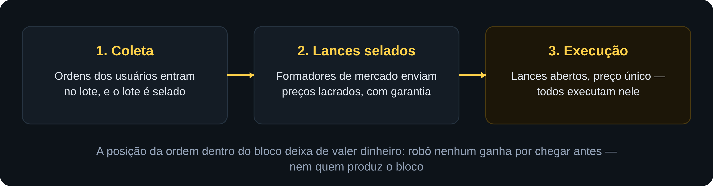
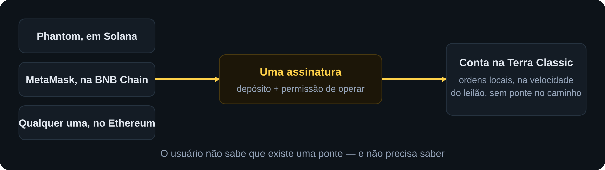
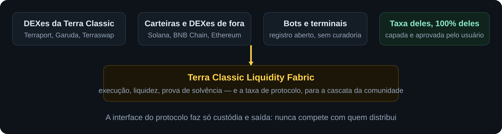
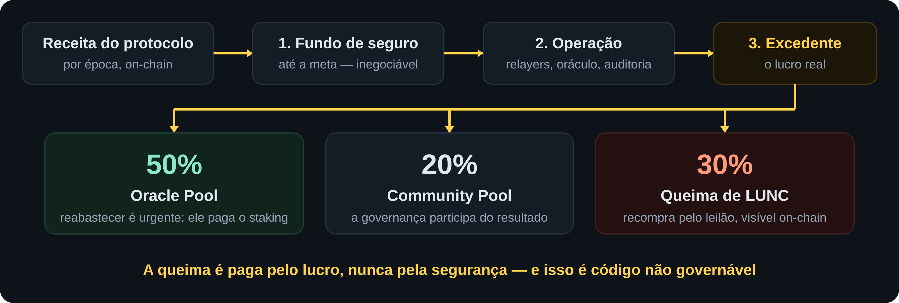
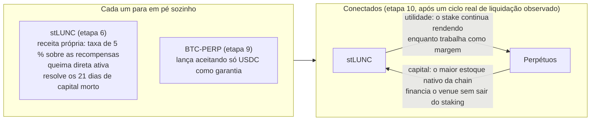
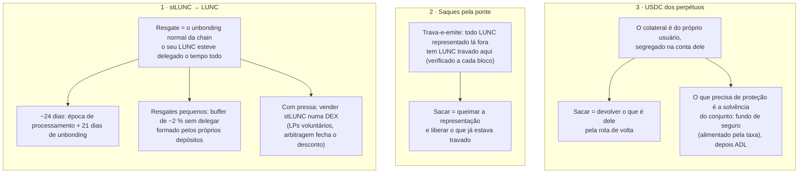

# Terra Classic Liquidity Fabric
## Proposta à comunidade, aos validadores e a investidores

**Versão:** 1.1 — setembro de 2026 (diagramas em imagem; os arquivos-fonte em SVG estão em [`img-src/`](img-src/))
**Base técnica:** Especificação v0.8.1, com decisões registradas (D-01 a D-22) e verificações públicas (G-01 a G-11)
**Discussão:** [Issues deste repositório](https://github.com/igorv43/proposal/issues)
**Versão em inglês (principal, com diagramas Mermaid):** [README.md](README.md)

---

## Resumo em cinco linhas

Propomos transformar a Terra Classic em **infraestrutura financeira multichain**: staking líquido nativo, mercados perpétuos executados por leilão de preço único, e acesso por qualquer carteira de qualquer chain com uma assinatura — tudo sob uma regra que nenhum concorrente pode copiar: **o lastro e a solvência se provam em consenso, a cada bloco, em vez de se prometer em documentação**. As interfaces pertencem às DEXes e carteiras que integrarem, cobrando a taxa delas; a chain fica com a taxa de protocolo, cuja sobra alimenta **50% o Oracle Pool, 20% o Community Pool e 30% a queima de LUNC**. Este pedido cobre apenas a fundação e o staking líquido; a camada de perpétuos volta ao plenário com seus próprios portões cumpridos.

---

## 1. A identidade do projeto

**A chain fornece a infraestrutura. As interfaces pertencem a quem integra.**

O Liquidity Fabric não é um app, não é uma DEX, não é mais um site. É a camada de ativos, contas, execução, colateral e prova que os aplicativos de todas as chains usam — e pela qual pagam. Quem busca o cliente e faz o marketing são as plataformas que já têm usuários: as DEXes da própria Terra Classic e as carteiras e DEXes de Solana, BNB Chain e Ethereum.

E a tese que atravessa tudo: **lastro que se prova, não se promete.** A Terra Classic é a chain cujo colapso ensinou ao setor inteiro o custo de um lastro que não se podia verificar. Este projeto é a inversão exata disso — e nenhum concorrente conta essa história com credibilidade, porque nenhum a viveu.

---

## 2. As quatro dores de hoje

| Dor | Quem sente |
|---|---|
| **Capital em staking é capital morto.** 21 dias de unbonding; quem faz staking não usa o próprio dinheiro para nada | Todo delegador de LUNC |
| **Não existem derivativos nativos.** Hedge e alavancagem sobre LUNC só em CEX ou em outra chain — o volume vai embora com o usuário | Traders e a própria chain |
| **Entrar é difícil.** Quem está em Solana, BNB Chain ou Ethereum precisa de ponte, carteira nova e gas novo antes da primeira transação | Todo usuário de fora |
| **O LUNC está fragmentado lá fora.** Representações diferentes em cada rede, sem contabilidade pública que prove o lastro de cada uma | Quem detém LUNC fora da chain |

Contexto de escala: o TVL DeFi somado da chain está na casa de **US$ 850 mil**, com volume diário de DEX de poucos milhares de dólares (DefiLlama, set/2026). Este projeto não disputa essa fatia — ele cria uma camada que hoje é aproximadamente zero: derivativos e acesso multichain.

---

## 3. O que será construído

Seis camadas, um produto:

| Camada | O que entrega |
|---|---|
| **Ativos multichain** | LUNC canônico, com representação auditável em cada rede |
| **Contas multichain** | Qualquer carteira opera com uma assinatura, sem ponte manual |
| **Confiança** | Lastro verificado em consenso a cada bloco, com pausa automática |
| **Execução** | Leilão de preço único e perpétuos com proteções gravadas na chain |
| **Capital nativo** | stLUNC como colateral neutro, que nunca vota por ninguém |
| **Distribuição** | DEXes e carteiras integram, cobram a taxa delas e trazem o cliente |

---

## 4. Como funciona, sem jargão

### 4.1 Lastro que se prova

A página de solvência é pública: qualquer pessoa consulta, por rede, quanto está representado, quanto está travado, a folga contra o teto e o histórico de pausas — **inclusive os alarmes falsos**, porque um registro que só mostra acertos não é um registro. O software do observador é aberto: "qualquer um pode verificar" só vale se qualquer um conseguir.

### 4.2 Um preço para todos

A posição da ordem dentro do bloco deixa de valer dinheiro: robô nenhum ganha por chegar antes — nem quem produz o bloco. O mesmo motor executa os perpétuos e qualquer mercado spot que a governança queira habilitar depois, sem código novo.

### 4.3 A conta vai até o usuário

O usuário não sabe que existe uma ponte — e não precisa saber. Cada carteira integrada em outra rede vira um canal de entrada para a Terra Classic.

### 4.4 A proteção mora na chain, não no navegador

- **Stop e alvo gravados na chain:** disparam sozinhos, mesmo com o investidor offline, sem internet, com o app fechado.
- **Saque com destino travado:** fundos só saem para a carteira do próprio dono. Nem uma mensagem forjada na ponte consegue roubar — comprometimento de ponte vira incômodo, não perda.
- **Atraso nunca vira perda:** mensagem lenta fica pendente até chegar, e qualquer pessoa pode entregá-la, inclusive o próprio usuário, pelo botão de reentrega.
- **Teto pela liquidez real:** nenhum mercado pode crescer além da profundidade medida por oráculo — a regra que impede a classe de ataque que constrangeu o líder do setor. E o LUNC-PERP será o **último** mercado, com os parâmetros mais restritivos, não o primeiro.
- **As ordens nunca passam pela ponte:** congestionamento de ponte não atrasa um único trade.
- E a honestidade obrigatória: **risco de mercado não é reversível** — nenhuma venue do mundo reverte movimento de preço, e esta proposta não dirá o contrário. O que garantimos é que atraso nunca vira perda de principal e que a defesa da posição não depende de reflexo humano.

---

## 5. O modelo de negócio: eles vendem, a chain fatura

O precedente do setor valida o modelo: o líder de perpétuos on-chain terceirizou a distribuição a mais de cem integradores; a carteira Phantom, de Solana, roteou dezenas de bilhões de dólares e faturou mais de US$ 20 milhões em cerca de um ano cobrando 0,05% por cima — sem construir exchange (fontes: relatórios públicos do programa de builder codes — CoinGecko Research, Blockworks, 2026).

E a regra que garante que nunca competiremos com quem nos distribui, escrita em código: **a interface do próprio protocolo faz apenas custódia, prova de solvência e saída** — fechar posição, cancelar, sacar. Abrir posição não existe nela. Sem abertura, ela não disputa um único trade; com saída garantida, nenhum usuário jamais fica preso a uma interface de terceiro para escapar de uma posição.

O lançamento dos perpétuos exige **pelo menos dois integradores em produção** — sem interfaces, não há produto, e o portão torna isso literal. O kit de integração (template, widget, SDK e sandbox) é aberto e reduz o custo de integrar a dias.

---

## 6. Quem já constrói aqui sai ganhando

| Projeto | Hoje | Com o fabric |
|---|---|---|
| **Terraport** | DEX, staking, launchpad | Frontend de perpétuos com a taxa deles por cima, sem construir exchange |
| **GarudaDefi** | AMM e farms | Mesma linha de receita nova, mais pares melhores com os ativos canônicos |
| **Terraswap** | AMM original da chain | Volume de arbitragem novo vindo do leilão interno |
| **Eris e demais LSTs** | Staking líquido em contrato | Rotas multichain para seus tokens; coexistência declarada, nada é desabilitado |
| **Validadores** | Recompensas minguando com o Oracle Pool baixo | 50% do excedente do protocolo reabastece o Oracle Pool, e o stLUNC mantém o stake delegado |

Sobre o staking líquido nativo: ele existe porque o caminho de liquidação dos perpétuos exige um ativo do próprio banco da chain, sem contrato de terceiro no meio — e porque **o colateral do sistema precisa ser neutro: o módulo nunca vota**, com teto por validador e teto global. O colateral de todos não pode ser a máquina de votos de nenhum projeto — incluindo este. Os LSTs existentes continuam operando e ganham rotas multichain se quiserem. **Compromisso de processo:** conversa direta com os times da chain antes de qualquer votação.

---

## 7. Para onde vai a receita: a cascata

Três regras acompanham a cascata, e as três são código:

1. **A queima é paga pelo lucro, nunca pela segurança.** Nada é queimado nem repassado com o fundo de seguro abaixo da meta. Isso é não governável.
2. **Sem meta, sem número, sem promessa.** O número de queima é o que o excedente pagar, e o histórico on-chain é a única propaganda.
3. **Queima nunca é argumento de preço.** Comunicar a cascata pode; prometer efeito, não.

E há queima antes mesmo dos perpétuos: **20% da taxa do staking líquido queima LUNC diretamente, sem conversão, desde a etapa do stLUNC** — pequena no início, verdadeira desde o primeiro dia, crescendo com o TVL. Além da cascata, todo o volume novo que o fabric gera paga gas e passa pela tributação on-chain vigente, alimentando a queima e o Community Pool que **já existem**.

---

## 8. Roadmap por portões, não por datas

| Etapa | Entrega | Só avança se |
|---|---|---|
| **Fundação** | Hyperlane nativo, LUNC canônico, migração das representações antigas, prova de lastro pública | Auditoria concluída; conta fechando bloco a bloco |
| **Staking líquido** | stLUNC com receita própria e queima direta ativa | Auditoria dedicada; 30 dias de invariantes limpas |
| **Portão de demanda** | Cartas de 3 formadores de mercado independentes + parecer jurídico | Sem compromissos assinados, os perpétuos não começam |
| **Testnet incentivada** | Motor de leilão + perpétuos + oráculo estendido | 60 dias de métricas cumpridas; zero violação de invariante |
| **BTC-PERP em mainnet** | Primeiro mercado, teto baixo | **Pelo menos 2 integradores em produção** |
| **Expansão** | ETH-PERP, stLUNC como garantia, LUNC-PERP por último | Critérios de continuidade medidos aos 6 meses |

Esforço estimado: fundação **4,5–7,5 engenheiro-mês**; camada financeira completa **27–41**, mais auditorias com orçamento próprio. Cada etapa tem ponto de parada honroso: um projeto que entrega a fundação e o staking líquido, e para aí, entregou valor real.

A chain roda Cosmos SDK v0.53, o que permite integrar os módulos oficiais do Hyperlane por composição, sem reescrever — a premissa técnica mais importante já está confirmada.

---

## 9. Os riscos, ditos de frente

| Risco | Como o desenho responde |
|---|---|
| Demanda não aparecer | Portões: nada avança sem compromissos assinados; a fundação já entrega valor sozinha |
| Dependência de integradores | Lançamento exige 2 em produção; kit pronto reduz integração a dias; o console garante saída sempre |
| Falha ou atraso de ponte | Ordens não passam pela ponte; valor em trânsito nunca se perde; 5 assinantes independentes, tolera 2 fora |
| Manipulação de mercado | Teto de posições limitado pela profundidade real, verificado em código; LUNC-PERP por último e restrito |
| Regulatório | Parecer jurídico é portão obrigatório antes de qualquer mercado; interfaces distribuídas, protocolo neutro |
| Risco de mercado do investidor | **Não é reversível, e esta proposta não dirá o contrário.** O que garantimos: atraso nunca vira perda de principal, e a proteção não depende de reflexo humano |
| Execução e concentração | Equipe mínima é condição de portão, não recomendação; especificação pública permite continuidade por terceiros |

---

## 10. O que esta proposta pede

1. **Aprovação do escopo da Fundação e do staking líquido** (etapas 0 a 6), com orçamento de **[ORÇAMENTO]** e equipe de **[EQUIPE]**, liberado por marcos auditáveis — não um cheque, uma sequência de entregas verificáveis.
2. **Reconhecimento da cascata de alocação** — fundo até a meta, operação com teto, e o excedente em 50% Oracle Pool / 20% Community Pool / 30% queima — como compromisso em código, consultável por qualquer um, época a época.
3. **Mandato para as conversas de integração** com os times da própria chain (Terraport, Garuda, Terraswap, Eris) e com carteiras e DEXes de fora, e para os pilotos com formadores de mercado — tudo antes de qualquer linha da camada de perpétuos.

A camada de perpétuos **volta ao plenário** com seus próprios portões cumpridos: compromissos assinados, parecer jurídico e testnet medida. Ninguém está pedindo aprovação para promessas.

---

## 11. Transparência permanente

- A especificação técnica completa (v0.8.1) é pública: cada decisão tem registro, alternativas descartadas e gatilho de revisão; cada dependência externa tem procedimento de verificação e consequência.
- Toda a contabilidade — lastro por rede, cascata da receita, queima acumulada — é consultável on-chain e exibida na página pública de solvência.
- Limites críticos são **não governáveis**: alavancagem máxima absoluta, fundo de seguro insacável para tesouraria, saque travado no dono, queima somente do excedente.

---

## 12. Perguntas frequentes

São as perguntas que aparecem primeiro quando a proposta é lida. Cada uma tem a
resposta curta, o detalhe e a parte que precisa ser dita com honestidade.

### 12.1 Por que o staking líquido está ligado ao perpétuo?

**Resposta curta:** eles não dependem um do outro para funcionar, mas um torna o
outro muito mais forte. São dois produtos que param em pé sozinhos e formam um
circuito quando conectados.

**O que NÃO é:** dependência. O staking líquido lança na etapa 6, antes de
qualquer perpétuo, com receita própria (a taxa de 5 % sobre as recompensas) e a
queima direta ativa. Se os perpétuos nunca saíssem do papel, o stLUNC continuaria
entregando valor sozinho. O inverso também vale: o BTC-PERP lança na etapa 9
aceitando só USDC como garantia; o stLUNC como colateral só entra na etapa 10,
depois de um ciclo real de liquidação observado. O roadmap foi desenhado assim de
propósito.

**Por que estão ligados — o circuito cria valor nos dois sentidos:**

- *O perpétuo dá utilidade ao stLUNC.* Um token de staking líquido só vale algo
  se tiver onde ser usado. Servir de garantia é o uso mais forte que existe: o
  stake continua rendendo enquanto trabalha como margem. Nenhuma CEX oferece isso
  para LUNC — lá, para operar, você resgata e para de render.
- *O stLUNC dá capital ao perpétuo.* O maior estoque de capital nativo da chain é
  o LUNC delegado. Sem stLUNC, a única garantia é USDC de fora, que precisa ser
  atraído. Com stLUNC, o capital que já existe na chain financia o venue sem sair
  do staking.
- *O detalhe de segurança que amarra tudo:* como a garantia é o stake líquido (e
  não LUNC solto), usar o venue nunca exige desfazer delegação. O perpétuo não
  drena a segurança do consenso — reforça, porque cria mais um motivo para
  delegar.

**Por que a ligação é restrita — a parte honesta.** stLUNC como garantia tem um
risco clássico, o *wrong-way risk*: se o LUNC cai, o valor da garantia cai junto,
exatamente na hora em que a posição pode estar perdendo. Por isso as regras duras
da decisão D-16:

| Regra (D-16) | Valor |
|---|---|
| Mercados que o stLUNC pode garantir | BTC e ETH apenas — **nunca o LUNC-PERP** (garantia e ativo caindo juntos seria a armadilha perfeita) |
| Desconto (haircut) sobre o valor do stLUNC | 35 % |
| Teto por conta | 50 % da garantia da conta |
| Fundo de seguro | tranche separada para posições garantidas por stLUNC |

**A ligação técnica que explica uma decisão.** A razão de o staking líquido ser
um módulo nativo (e não usar os LSTs de contrato que já existem) vem justamente do
perpétuo: o caminho de liquidação precisa apreender e precificar a garantia sem
nenhum contrato de terceiro ou chave de admin no meio. O perpétuo não criou a
necessidade do staking líquido; ele definiu como o staking líquido precisa ser
construído para que os dois possam se conectar com segurança depois.

*Uma analogia:* o stLUNC é o CDB que continua rendendo; o perpétuo é o banco que
aceita esse CDB como margem sem você precisar resgatar. O banco funciona sem
aceitar CDB, e o CDB rende sem banco nenhum — mas juntos, o dinheiro trabalha
duas vezes.

### 12.2 Quem banca a liquidez para os saques? A comunidade vai precisar dar um aporte?

**Resposta curta:** ninguém precisa bancar, e a comunidade não aporta nada —
porque nenhum dos três tipos de saque do sistema depende de uma piscina de
liquidez. O orçamento que a proposta pede é para engenharia e auditoria, não
para liquidez.

**1. Resgate de stLUNC → LUNC.** O resgate não é um swap — é o unbonding normal
do staking da chain. Cada stLUNC corresponde, por construção, a LUNC realmente
delegado mais as recompensas acumuladas; o módulo não empresta, não aluga e não
rehipoteca nada. Ao resgatar, o módulo entra na fila de unbonding do próprio
staking module e, depois de ~24 dias (a época de processamento + os 21 dias de
unbonding), o seu próprio LUNC, que estava delegado o tempo todo, volta para
você. Não existe liquidez a ser bancada porque o dinheiro nunca saiu do lugar —
o tempo de espera é justamente a prova disso. Um resgate instantâneo e ilimitado
é que deveria assustar: significaria que o lastro não está em staking de verdade.

Três complementos honestos: (a) um buffer de ~2 % dos depósitos fica sem delegar
para atender resgates pequenos na hora — formado pelos próprios depósitos, não
por aporte; (b) quem não quer esperar 24 dias vende o stLUNC no mercado
secundário (pools nas DEXes da chain — mais receita para elas), onde a liquidez
é de LPs voluntários com incentivo econômico: se o stLUNC negociar abaixo do
valor de resgate, arbitradores compram com desconto e resgatam pelo caminho
lento, e esse lucro é o que puxa o preço de volta; (c) em pânico de mercado, o
desconto no secundário pode abrir — a saída imediata pode custar caro, mas o
resgate integral pelo caminho lento continua garantido pelo lastro, sempre.

**2. Saques pela ponte.** Modelo trava-e-emite: todo LUNC representado lá fora
tem LUNC travado aqui (a invariante que a chain verifica a cada bloco). Sacar é
queimar a representação e liberar o que já estava travado. Não há pool, não há
aporte — há lastro.

**3. Saques de USDC dos perpétuos.** O colateral é do próprio usuário, segregado
na conta dele; sacar é devolver o que é dele pela rota de volta. O que precisa
de proteção não é o saque — é a solvência do conjunto (o ganho de um trader é
pago pela perda de outro), e isso é papel do fundo de seguro, alimentado pela
taxa do protocolo (o primeiro degrau da cascata, antes de Oracle Pool, Community
Pool e queima), não por aporte. O lançamento começa com tetos de posição baixos
exatamente para que a exigência do fundo seja pequena no início e cresça com a
receita. Se o fundo se esgotar num evento extremo, o backstop final é o ADL —
regra pré-publicada e determinística — e nunca um chamado de capital à
comunidade.

**A pergunta política, respondida diretamente.** A liquidez de mercado (LPs no
secundário do stLUNC, formadores de mercado nos perpétuos) vem de participantes
com lucro próprio — e é por isso que existe o portão das três cartas de
formadores de mercado antes de qualquer perpétuo: o projeto não lança contando
com liquidez que não se comprometeu por escrito. Se um dia a comunidade quiser
acelerar com incentivos de LP, isso seria uma proposta separada e opcional — o
desenho funciona sem.

**E se todo mundo sacar ao mesmo tempo?** stLUNC: todos entram na fila de
unbonding e todos recebem o próprio LUNC após o prazo; o preço no secundário
pode cair nesse meio-tempo, o lastro não. Ponte: cada representação queima
contra LUNC já travado, um para um. Perpétuos: cada conta saca o próprio
colateral segregado; posições abertas seguem as regras de risco publicadas.

### 12.3 Perpétuos — estamos falando de alavancagem ou não?

**Resposta curta:** sim. Alavancagem é o coração do produto, e esta proposta diz
isso com clareza. O que ela também diz: aqui a alavancagem é um dial, limitada
em código a níveis conservadores, com stop gravado na chain e liquidação por
regra publicada.

**O que é um perpétuo.** Um contrato em que você toma posição no preço de um
ativo (BTC, ETH) sem nunca possuí-lo, sem prazo de vencimento, depositando só
uma margem — e é aí que entra a alavancagem: a posição pode ser maior que a
margem. Com 100 USDC de margem a 2×, você controla uma posição de 200 USDC. Se o
BTC sobe 5 %, você ganha 10 USDC — 10 % sobre o seu capital; se cai 5 %, perde os
mesmos 10. A alavancagem multiplica os dois lados. O "perpétuo" do nome vem de
não vencer nunca: em vez de um futuro com data, existe o *funding* — um
pagamento periódico entre comprados e vendidos que mantém o preço do contrato
colado ao preço à vista. E se o mercado anda contra você além do que a margem
aguenta, a *liquidação* fecha a posição à força antes que a perda supere o
depósito — é isso que o fundo de seguro, o ADL e todo o aparato de risco da
especificação existem para administrar.

**Alavancagem é um dial, não uma obrigação.** Operar a 1× — posição igual à
margem — é possível e é simplesmente exposição ao preço sem multiplicador. O
desenho é deliberadamente conservador no dial:

| Mercado | Alavancagem no lançamento | Teto absoluto (em código, não governável) |
|---|---|---|
| BTC-PERP, ETH-PERP | 3× | 10× |
| LUNC-PERP (último mercado) | 2× | 10× |
| Referência da indústria | 50×, 100× ou mais | — |

É uma decisão de identidade: numa chain cuja biografia é o colapso, um cassino
de 100× seria suicídio narrativo. O argumento de venda nunca foi "alavanque
mais"; é "opere onde a solvência se prova".

**Por que ter alavancagem, e não só spot?** Três razões:

1. **Hedge** — o uso mais defensável: quem tem LUNC ou BTC e teme uma queda pode
   se proteger vendido sem vender o ativo (e aqui, sem nem desfazer o staking).
   Isso só existe com derivativo.
2. **Eficiência de capital** — o formador de mercado que provê liquidez com
   margem cota muito mais com o mesmo capital; sem isso, não há liquidez
   competitiva.
3. **O fato frio do mercado** — perpétuos são onde está o volume on-chain de
   verdade; é o produto pelo qual integradores e traders aparecem, e o volume é
   o que alimenta a cascata (Oracle Pool, Community Pool, queima).

**Spot no mesmo motor.** Mercado spot é o mesmo leilão sem alavancagem: você
deposita o valor inteiro e troca o ativo inteiro. Por isso o spot virou "tipo de
mercado opcional" — é o caso particular do motor com o dial em zero. O perpétuo
é o caso geral, com margem.

**A frase honesta para o plenário:** sim, é alavancagem — limitada em código a
níveis conservadores, com stop gravado na chain, liquidação por regra publicada
e nunca acima do que a profundidade real do mercado suporta. Alavancagem sem
esses limites é o que quebra protocolos; alavancagem com esses limites é o que
paga a queima.

---

## Encerramento

> **A chain que caiu pelo lastro que não se via será a referência do lastro que se prova.**

A comunidade não precisa confiar neste texto. Ela pode ler o código, consultar a chain e verificar cada número — e é exatamente essa a proposta.

**Discussão e contato:** [Issues deste repositório](https://github.com/igorv43/proposal/issues) · [Igor Veras no X](https://x.com/igorsoares62)

---

## Diagramas

| # | Arquivo | Fonte SVG |
|---|---|---|
| 1 | [img/01-circuito.png](img/01-circuito.png) — o circuito produtivo do stake | [img-src/01-circuito.svg](img-src/01-circuito.svg) |
| 2 | [img/02-lastro.png](img/02-lastro.png) — a equação do lastro | [img-src/02-lastro.svg](img-src/02-lastro.svg) |
| 3 | [img/03-leilao.png](img/03-leilao.png) — o leilão de preço único | [img-src/03-leilao.svg](img-src/03-leilao.svg) |
| 4 | [img/04-acesso.png](img/04-acesso.png) — acesso multichain | [img-src/04-acesso.svg](img-src/04-acesso.svg) |
| 5 | [img/05-integradores.png](img/05-integradores.png) — modelo de integradores | [img-src/05-integradores.svg](img-src/05-integradores.svg) |
| 6 | [img/06-cascata.png](img/06-cascata.png) — a cascata da receita | [img-src/06-cascata.svg](img-src/06-cascata.svg) |

Para republicar em fóruns, use as URLs absolutas das imagens neste repositório
(`https://raw.githubusercontent.com/igorv43/proposal/main/img/<arquivo>.png`).
