# Terra Classic Liquidity Fabric

## A proposal to the community, validators and investors

| | |
|---|---|
| **Version** | 1.1 — September 2026 |
| **Technical basis** | Specification v0.8.1, with recorded decisions (D-01 to D-22) and public verifications (G-01 to G-11) |
| **Discussion** | [Issues of this repository](https://github.com/igorv43/proposal/issues) |
| **Author** | Igor Veras — [GitHub](https://github.com/igorv43) · [X](https://x.com/igorsoares62) |
| **Portuguese version** | [PROPOSTA-PT.md](PROPOSTA-PT.md) |

> **How to read this document.** Sections 1–3 explain *what* and *why* in plain
> language. Section 4 explains *how it works*. Sections 5–7 cover the business
> model and where the money goes. Sections 8–11 cover the roadmap, governance,
> risks and what is being asked. Every diagram is drawn in the text itself
> (Mermaid), so it renders on GitHub and in any Markdown viewer. A glossary is at
> the end.

---

## Summary in five lines

We propose turning Terra Classic into **multichain financial infrastructure**:
native liquid staking, perpetual markets executed by single-price auction, and
access from any wallet on any chain with one signature — all under a rule no
competitor can copy: **backing and solvency are proven in consensus, every
block, instead of promised in documentation.** The user interfaces belong to the
DEXes and wallets that integrate, charging their own fee; the chain keeps the
protocol fee, whose surplus feeds **50 % the Oracle Pool, 20 % the Community
Pool and 30 % LUNC burn**. This request covers only the foundation and liquid
staking; the perpetuals layer returns to the floor with its own gates met.

### The whole idea in one picture

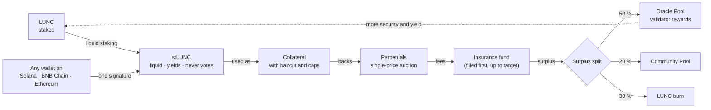

*Everything runs on the asset's own chain, under solvency rules enforced by
consensus. No competitor can assemble this circuit: none of them is the home of
LUNC.*

---

## 1. The identity of the project

**The chain provides the infrastructure. The interfaces belong to whoever integrates.**

The Liquidity Fabric is not an app, not a DEX, not another website. It is the
layer of assets, accounts, execution, collateral and proof that applications on
every chain use — and pay for. The ones who find the customer and do the
marketing are the platforms that already have users: Terra Classic's own DEXes,
and the wallets and DEXes of Solana, BNB Chain and Ethereum.

And the thesis that runs through everything: **backing that is proven, not
promised.** Terra Classic is the chain whose collapse taught the whole industry
the cost of backing that could not be verified. This project is the exact
inversion of that — and no competitor can tell this story with credibility,
because none of them lived it.

---

## 2. The four pains of today

| Pain | Who feels it |
|---|---|
| **Staked capital is dead capital.** 21 days of unbonding; stakers cannot use their own money for anything | Every LUNC delegator |
| **No native derivatives.** Hedging and leverage on LUNC only on CEXes or other chains — the volume leaves with the user | Traders and the chain itself |
| **Getting in is hard.** A user on Solana, BNB Chain or Ethereum needs a bridge, a new wallet and new gas before the first transaction | Every outside user |
| **LUNC is fragmented out there.** Different representations on each network, with no public accounting proving the backing of each | Everyone holding LUNC off-chain |

Scale context: the chain's combined DeFi TVL is around **US$ 850 thousand**, with
daily DEX volume of a few thousand dollars (DefiLlama, Sep 2026). This project
does not compete for that slice — it creates a layer that is approximately zero
today: derivatives and multichain access.

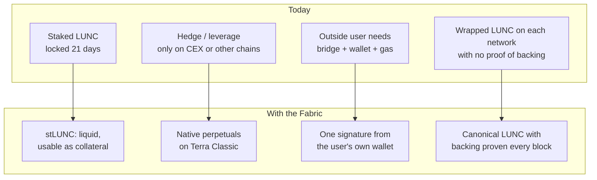

---

## 3. What will be built

Six layers, one product:

| Layer | What it delivers |
|---|---|
| **Multichain assets** | Canonical LUNC, with an auditable representation on each network |
| **Multichain accounts** | Any wallet operates with one signature, no manual bridging |
| **Trust** | Backing verified in consensus every block, with automatic pause |
| **Execution** | Single-price auction and perpetuals with protections written on-chain |
| **Native capital** | stLUNC as neutral collateral that never votes for anyone |
| **Distribution** | DEXes and wallets integrate, charge their own fee and bring the customer |

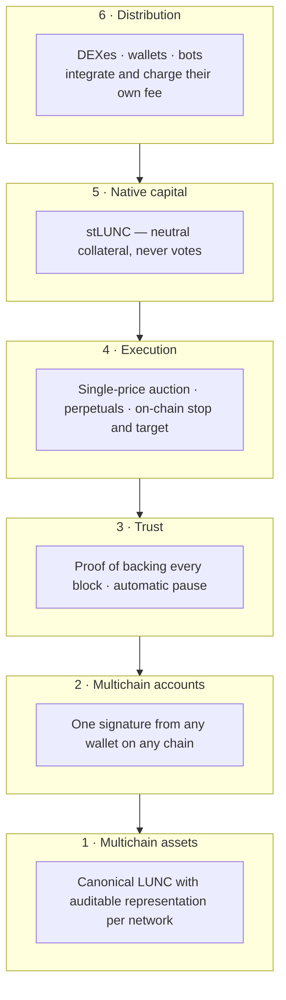

---

## 4. How it works, without jargon

### 4.1 Backing that is proven

The rule is an equation the chain checks every block:

> **LUNC locked here = LUNC represented out there + LUNC in transit.**
> If the numbers do not match, the route pauses by itself.

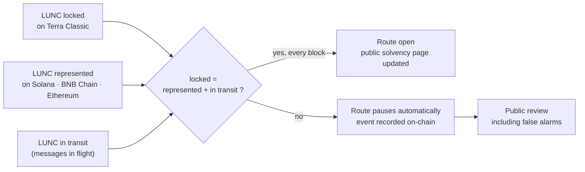

The solvency page is public: anyone can check, per network, how much is
represented, how much is locked, the headroom against the cap and the history of
pauses — **including the false alarms**, because a record that only shows
successes is not a record. The observer software is open source: "anyone can
verify" only holds if anyone actually can.

### 4.2 One price for everyone

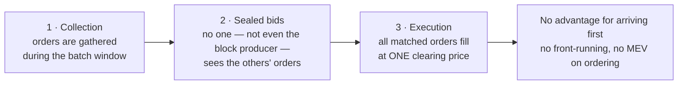

The position of an order inside the block stops being worth money: no bot wins
by arriving first — not even the one producing the block. The same engine
executes the perpetuals and any spot market governance may enable later, with no
new code.

### 4.3 The account comes to the user

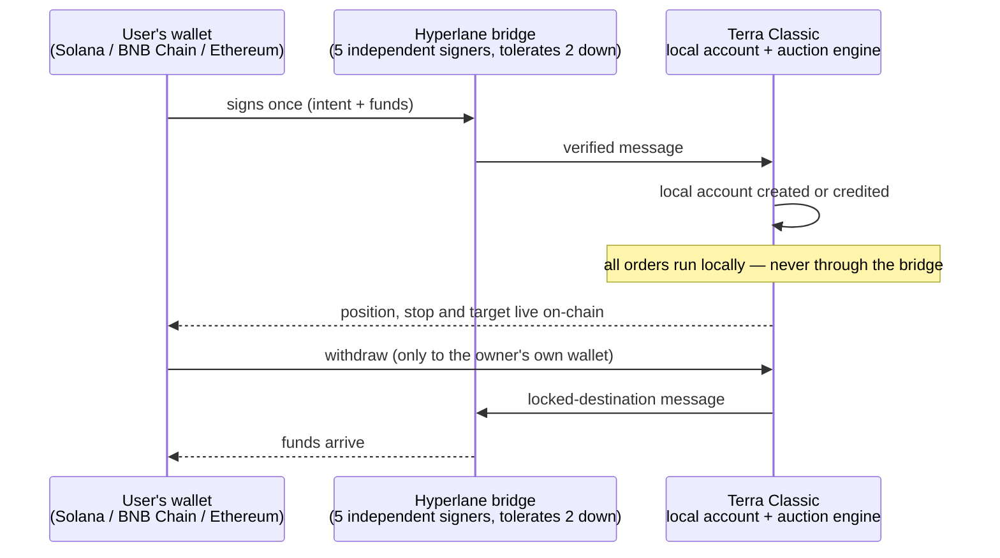

The user does not know there is a bridge — and does not need to. Every
integrated wallet on another network becomes an entry channel into Terra Classic.

### 4.4 Protection lives on the chain, not in the browser

- **Stop and target written on-chain:** they trigger by themselves, even with
  the investor offline, without internet, with the app closed.
- **Withdrawals with a locked destination:** funds only leave to the owner's own
  wallet. Not even a forged bridge message can steal — a bridge compromise
  becomes an inconvenience, not a loss.
- **Delay never becomes loss:** a slow message stays pending until it arrives,
  and anyone can deliver it, including the user, through the redelivery button.
- **Cap by real liquidity:** no market can grow beyond the depth measured by the
  oracle — the rule that prevents the class of attack that constrained the
  sector leader. And LUNC-PERP will be the **last** market, with the most
  restrictive parameters, not the first.
- **Orders never cross the bridge:** bridge congestion does not delay a single
  trade.
- And the mandatory honesty: **market risk is not reversible** — no venue in the
  world reverses a price move, and this proposal will not say otherwise. What we
  guarantee is that delay never becomes loss of principal and that defending a
  position does not depend on human reflexes.

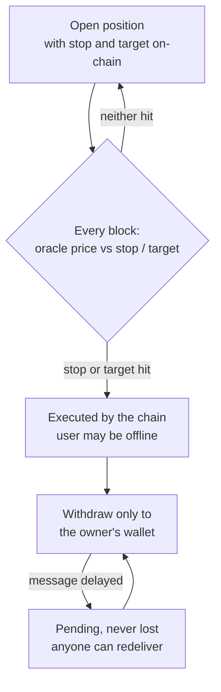

---

## 5. The business model: they sell, the chain earns

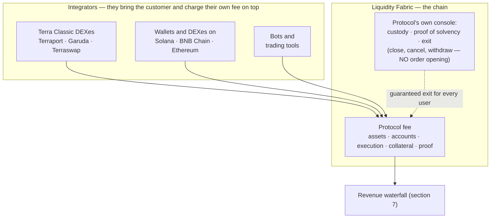

The industry precedent validates the model: the leading on-chain perpetuals venue
outsourced distribution to more than a hundred integrators; Solana's Phantom
wallet routed tens of billions of dollars and earned more than US$ 20 million in
about a year charging 0.05 % on top — without building an exchange (sources:
public reports on the builder-codes program — CoinGecko Research, Blockworks,
2026).

And the rule that guarantees we will never compete with those who distribute us,
written in code: **the protocol's own interface does only custody, proof of
solvency and exit** — close position, cancel, withdraw. Opening a position does
not exist in it. Without opening, it never competes for a single trade; with
guaranteed exit, no user is ever stuck depending on a third-party interface to
escape a position.

Launching perpetuals requires **at least two integrators in production** —
without interfaces there is no product, and the gate makes that literal. The
integration kit (template, widget, SDK and sandbox) is open and cuts integration
cost to days.

---

## 6. Those already building here come out ahead

| Project | Today | With the Fabric |
|---|---|---|
| **Terraport** | DEX, staking, launchpad | Perpetuals front end with their own fee on top, without building an exchange |
| **GarudaDefi** | AMM and farms | Same new revenue line, plus better pairs with the canonical assets |
| **Terraswap** | The chain's original AMM | New arbitrage volume coming from the internal auction |
| **Eris and other LSTs** | Liquid staking in contracts | Multichain routes for their tokens; declared coexistence, nothing is disabled |
| **Validators** | Rewards shrinking with a low Oracle Pool | 50 % of the protocol surplus refills the Oracle Pool, and stLUNC keeps the stake delegated |

On native liquid staking: it exists because the liquidation path of the
perpetuals requires an asset from the chain's own bank module, with no
third-party contract in between — and because **the system's collateral must be
neutral: the module never votes**, with a per-validator cap and a global cap.
Everyone's collateral cannot be anyone's voting machine — including this
project's. Existing LSTs keep operating and gain multichain routes if they want.
**Process commitment:** direct conversation with the chain's teams before any
vote.

---

## 7. Where the revenue goes: the waterfall

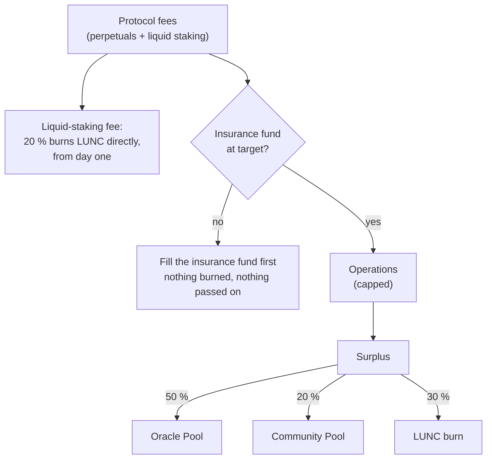

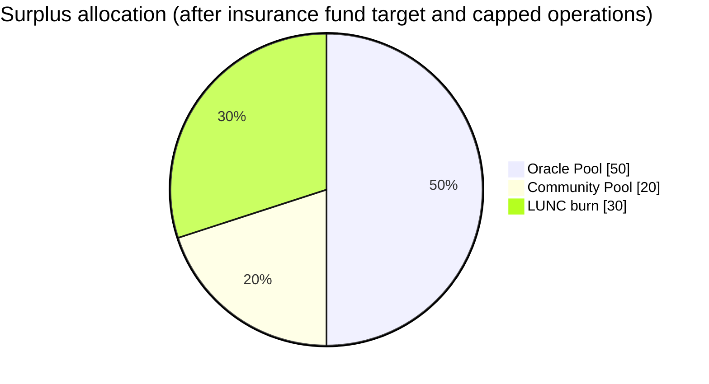

Three rules accompany the waterfall, and all three are code:

1. **Burn is paid by profit, never by security.** Nothing is burned or passed on
   while the insurance fund is below target. This is non-governable.
2. **No target, no number, no promise.** The burn figure is whatever the surplus
   pays, and the on-chain history is the only advertising.
3. **Burn is never a price argument.** Communicating the waterfall is allowed;
   promising an effect is not.

And there is burn even before the perpetuals: **20 % of the liquid-staking fee
burns LUNC directly, with no conversion, from the stLUNC stage** — small at
first, real from day one, growing with TVL. Beyond the waterfall, all the new
volume the Fabric generates pays gas and goes through the current on-chain tax,
feeding the burn and the Community Pool that **already exist**.

---

## 8. Roadmap by gates, not by dates

```mermaid
flowchart TB
    S0["Foundation<br/>native Hyperlane · canonical LUNC ·<br/>migration of old wrappers ·<br/>public proof of backing"] --> G0{"Audit done ·<br/>equation closes<br/>block by block"}
    G0 --> S1["Liquid staking<br/>stLUNC with own revenue ·<br/>direct burn active"]
    S1 --> G1{"Dedicated audit ·<br/>30 days of clean invariants"}
    G1 --> S2["Demand gate<br/>letters from 3 independent<br/>market makers + legal opinion"]
    S2 --> G2{"Signed commitments?<br/>no → perpetuals do not start"}
    G2 --> S3["Incentivized testnet<br/>auction engine · perpetuals ·<br/>extended oracle"]
    S3 --> G3{"60 days of metrics met ·<br/>zero invariant violations"}
    G3 --> S4["BTC-PERP on mainnet<br/>first market, low cap"]
    S4 --> G4{"At least 2 integrators<br/>in production"}
    G4 --> S5["Expansion<br/>ETH-PERP · stLUNC as collateral ·<br/>LUNC-PERP last"]
    S5 --> G5{"Continuity criteria<br/>measured at 6 months"}
    style G0 fill:#f6e05e,color:#000
    style G1 fill:#f6e05e,color:#000
    style G2 fill:#f6e05e,color:#000
    style G3 fill:#f6e05e,color:#000
    style G4 fill:#f6e05e,color:#000
    style G5 fill:#f6e05e,color:#000
```

| Stage | Deliverable | Advances only if |
|---|---|---|
| **Foundation** | Native Hyperlane, canonical LUNC, migration of the old representations, public proof of backing | Audit completed; the equation closes block by block |
| **Liquid staking** | stLUNC with its own revenue and direct burn active | Dedicated audit; 30 days of clean invariants |
| **Demand gate** | Letters from 3 independent market makers + legal opinion | Without signed commitments, perpetuals do not start |
| **Incentivized testnet** | Auction engine + perpetuals + extended oracle | 60 days of metrics met; zero invariant violations |
| **BTC-PERP on mainnet** | First market, low cap | **At least 2 integrators in production** |
| **Expansion** | ETH-PERP, stLUNC as collateral, LUNC-PERP last | Continuity criteria measured at 6 months |

Estimated effort: foundation **4.5–7.5 engineer-months**; complete financial
layer **27–41**, plus audits with their own budget. Every stage has an honourable
stopping point: a project that delivers the foundation and liquid staking, and
stops there, has delivered real value.

The chain runs Cosmos SDK v0.53, which allows integrating the official Hyperlane
modules by composition, without rewriting — the most important technical premise
is already confirmed.

---

## 9. Who decides what: governance and organization

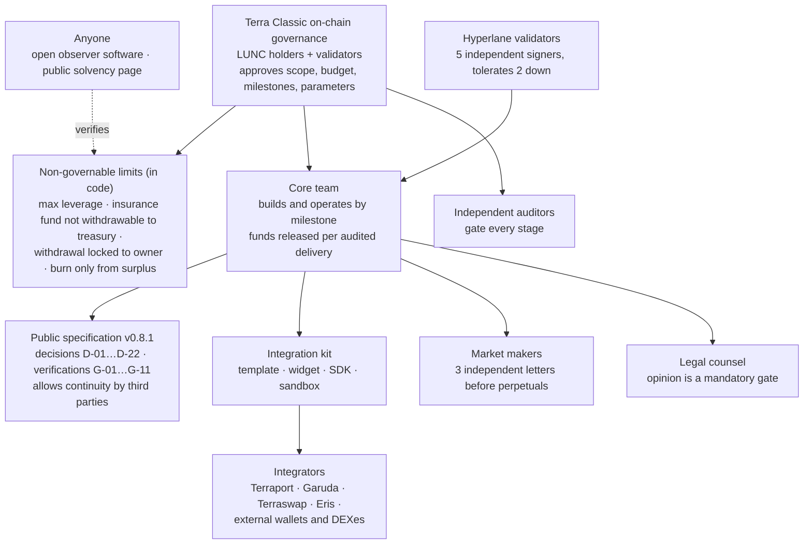

- **Governance** approves scope and budget per milestone and can change
  governable parameters; it cannot change the non-governable limits.
- **The core team** delivers by gates; a minimum team is a gate condition, not a
  recommendation.
- **Integrators, market makers and legal counsel** are external and independent;
  their commitments are gates, not assumptions.
- **Anyone** can verify the state of the system: the observer software is open
  and the solvency page is public.

---

## 10. The risks, said up front

| Risk | How the design answers |
|---|---|
| Demand does not show up | Gates: nothing advances without signed commitments; the foundation already delivers value on its own |
| Dependence on integrators | Launch requires 2 in production; the ready kit cuts integration to days; the console guarantees exit always |
| Bridge failure or delay | Orders do not cross the bridge; value in transit is never lost; 5 independent signers, tolerates 2 down |
| Market manipulation | Position caps limited by real depth, verified in code; LUNC-PERP last and restricted |
| Regulatory | Legal opinion is a mandatory gate before any market; distributed interfaces, neutral protocol |
| The investor's market risk | **Not reversible, and this proposal will not say otherwise.** What we guarantee: delay never becomes loss of principal, and protection does not depend on human reflexes |
| Execution and concentration | Minimum team is a gate condition, not a recommendation; the public specification allows continuity by third parties |

---

## 11. What this proposal asks

1. **Approval of the scope of the Foundation and liquid staking** (stages 0 to
   6), with a budget of **[BUDGET]** and a team of **[TEAM]**, released by
   auditable milestones — not a cheque, a sequence of verifiable deliveries.
2. **Recognition of the allocation waterfall** — fund up to target, operations
   with a cap, and the surplus 50 % Oracle Pool / 20 % Community Pool / 30 %
   burn — as a commitment in code, queryable by anyone, epoch by epoch.
3. **A mandate for the integration conversations** with the chain's own teams
   (Terraport, Garuda, Terraswap, Eris) and with outside wallets and DEXes, and
   for the pilots with market makers — all before any line of the perpetuals
   layer.

The perpetuals layer **returns to the floor** with its own gates met: signed
commitments, legal opinion and a measured testnet. Nobody is asking for approval
of promises.

---

## 12. Permanent transparency

- The complete technical specification (v0.8.1) is public: every decision has a
  record, discarded alternatives and a review trigger; every external dependency
  has a verification procedure and a consequence.
- All accounting — backing per network, revenue waterfall, accumulated burn — is
  queryable on-chain and shown on the public solvency page.
- Critical limits are **non-governable**: absolute maximum leverage, insurance
  fund not withdrawable to treasury, withdrawal locked to the owner, burn only
  from surplus.

---

## Closing

> **The chain that fell because of backing no one could see will become the
> reference for backing that is proven.**

The community does not need to trust this text. It can read the code, query the
chain and verify every number — and that is exactly the proposal.

**Discussion and contact:** [Issues of this repository](https://github.com/igorv43/proposal/issues) · [Igor Veras on X](https://x.com/igorsoares62)

---

## Glossary

| Term | Meaning |
|---|---|
| **LUNC** | Luna Classic, the native coin of the Terra Classic blockchain |
| **stLUNC** | Liquid-staking token: represents staked LUNC, keeps earning, can be used as collateral, and the module behind it never votes |
| **Perpetuals (perps)** | Derivative contracts with no expiry, used for hedging or leverage |
| **Single-price auction** | Orders are collected in a batch and all fill at one clearing price; being first in the block gives no advantage |
| **Collateral / haircut** | Assets pledged to back a position; the haircut is the discount applied to their value for safety |
| **Insurance fund** | Reserve that absorbs losses before anyone else; filled before any surplus is distributed |
| **Oracle Pool** | The pool that pays Terra Classic validators for oracle work; a share of the surplus refills it |
| **Community Pool** | Terra Classic's on-chain treasury, controlled by governance |
| **Hyperlane** | The interoperability protocol used for messages and asset transfers between Terra Classic and other chains |
| **Canonical LUNC** | The single official representation of LUNC on each external network, with backing proven on-chain |
| **Invariant** | A rule the system must never break (e.g. locked = represented + in transit); a violation pauses the route |
| **Gate** | A verifiable condition that must be met before the next stage starts |
| **TVL** | Total value locked in a protocol or chain |
| **LST** | Liquid-staking token (e.g. Eris's) |
| **Market maker** | A firm that continuously quotes buy and sell prices, providing liquidity |

## Diagrams

All diagrams in this document are written in [Mermaid](https://mermaid.js.org/)
and render natively on GitHub. The Portuguese version uses the same diagrams as
images: PNG in [`img/`](img/) and SVG sources in [`img-src/`](img-src/).
